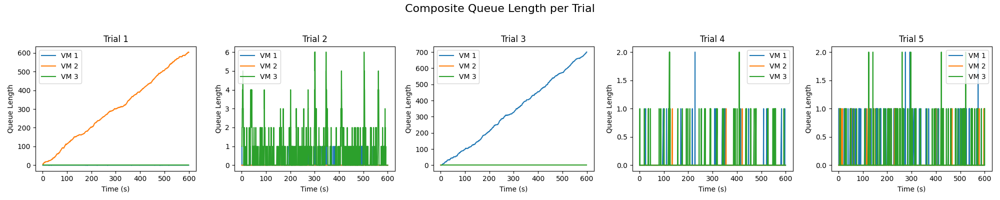

# Engineering Notebook: Asynchronous Distributed Logical Clocks

**Date:** March 3, 2025

## Project Overview
The primary objective of this project was to simulate an asynchronous distributed system using three virtual machines (VMs). Each VM communicates asynchronously via WebSockets, exchanging messages formatted in JSON. Each VM was assigned a random "clock rate" between 1 and 6 ticks per second and maintained a Lamport-style logical clock. The logical clock increments upon internal events, send events, and when receiving messages. During initialization, VMs established mutual connections and logged all event types—internal, send, and receive—recording system timestamps, logical clock values, and additional details like message queue lengths.

## Design Decisions
- **Asynchronous Simulation & WebSocket Communication:**  
  Each VM operated on unique ports (8001, 8002, and 8003) and utilized the `websockets` library in conjunction with asyncio for concurrent processing. Connections among VMs were initiated at startup, and messages were consistently formatted in JSON.

- **Clock Rate and Logical Clock Implementation:**  
  Each VM randomly selected a clock rate within the range of 1 to 6 ticks per second. For each tick:
  - Upon receiving messages, the VM processed them and updated its logical clock following Lamport’s rule:
    **new_clock = max(local_clock, received_clock) + 1**.
  - In the absence of incoming messages, the VM randomly executed either a send or internal event, both resulting in the logical clock incrementing by one.

- **Logging and Trials:**  
  Events were systematically logged with precise timestamps, event types, logical clock values, and message queue lengths. Introducing a `--trial` parameter allowed individual simulation trials to produce distinct log files (e.g., `vm_1_trial1.log`, `vm_1_trial2.log`, etc.) facilitating clearer analysis.

- **Randomized Behavior:**  
  A random number (between 1 and 10) determined each tick's outcome as either a send event (to one or both peers) or an internal event. This randomness introduced variability, creating visible logical clock "jumps" upon message receipt.

## Observations from Trials

After conducting five trials, logs from each VM were parsed, generating **three composite plots**, each containing side-by-side subplots for Trials 1 through 5:

1. **Composite Average Inter-Event Time (Figure 1)**
2. **Composite Logical Clock Progression (Figure 2)**
3. **Composite Queue Length (Figure 3)**

> **Figure 1:** *Composite Avg Inter-Event Time per Trial*  
> Each subplot illustrates the average interval between consecutive logged events for VM1, VM2, and VM3 in each trial.


> **Figure 2:** *Composite Logical Clock per Trial*  
> Each subplot depicts the logical clock progression of VM1, VM2, and VM3 over a 60-second duration.


> **Figure 3:** *Composite Queue Length per Trial*  
> Each subplot reveals fluctuations in queue length, highlighting moments when message processing lags behind incoming messages.


Below summarizes key behaviors from the generated plots:

### 1. Average Inter-Event Time
- In **Figure 1**, VM inter-event times varied notably (approximately 0.1 s to 0.7 s), reflecting each VM’s randomly selected clock rate and distribution of internal versus send events.
- Higher clock rates corresponded with more frequent events and shorter average inter-event times, while slower clock rates produced fewer events with longer intervals.

### 2. Logical Clock Progression
- **Figure 2** showed logical clocks for all VMs progressing from nearly zero at start to around 60 seconds.
- Some trials displayed closely aligned logical clocks due to similar tick rates and message exchanges, whereas others exhibited one VM outpacing the rest.
- Noticeable "crossovers" or vertical shifts occurred when VMs received messages with significantly higher clock values, causing abrupt upward adjustments.

### 3. Queue Length Dynamics
- In **Figure 3**, message queues remained mostly near zero but occasionally spiked significantly (up to 3–5 messages) during rapid bursts of incoming messages.
- These queue spikes typically occurred due to slower VM clock rates or random event distributions leading to multiple quick message transmissions.

## Detailed Per‑Trial Highlights

### Trial 1
- **Assigned Clock Speeds:**
  - **VM1:** 1 tick/sec
  - **VM2:** 2 ticks/sec (**fastest**)
  - **VM3:** 1 tick/sec
- **Observations:**
  - **Fast VM2:** Because VM2 runs at 2 ticks/sec while VM1 and VM3 both run at 1 tick/sec, VM2 produces events (send or internal) more frequently than its peers.  
  - **Queue Lengths:**  
    - VM2 rarely accumulates any backlog; it quickly processes and sends messages.  
    - VM3, the slowest (tied with VM1), sees occasional queue spikes, especially when multiple messages arrive in short bursts from the faster VM2.  
  - **Inter‑Event Times:** In the “Composite Avg Inter‑Event Time” graph, VM2 shows the shortest bar (most frequent events), while VM1 and VM3 have longer intervals.

### Trial 4
- **Assigned Clock Speeds:**
  - **VM1:** 5 ticks/sec
  - **VM2:** 1 tick/sec (**slowest**)
  - **VM3:** 5 ticks/sec (**tied fastest**)
- **Observations:**
  - **Slow VM2 Overwhelmed:** With VM2 running at just 1 tick/sec while VM1 and VM3 tick at 5 ticks/sec, VM2 receives messages far faster than it can process them.  
  - **High Queue Buildup:**  
    - The “Composite Queue Length” graph shows VM2’s backlog climbing steadily to ~14–15 messages.  
    - Meanwhile, VM1 and VM3 maintain low queue lengths because they process messages (and send out new ones) five times as often as VM2.  
  - **Inter‑Event Times:** In the “Composite Avg Inter‑Event Time” graph, VM2’s bar is highest (longest gap between events), whereas VM1 and VM3 have much shorter bars.

---

### Why Trials 1 and 4 Stand Out

- **Role Reversal of VM2:**  
  - In **Trial 1**, VM2 is the *fastest* clock (2 ticks/sec) and rarely builds a backlog.  
  - In **Trial 4**, VM2 is the *slowest* (1 tick/sec) and gets flooded by VM1/VM3, leading to large queue spikes.

- **Impact on System Dynamics:**  
  - **Faster VMs** produce more frequent sends, often forcing slower peers to jump their logical clocks significantly upon receiving high‑timestamp messages.  
  - **Slower VMs** can develop large message queues if the faster VMs’ send events arrive in bursts.  

### General Findings
Consistent behaviors were observed throughout all trials:
- **Logical Clock Updates:** Internal events consistently incremented clocks by one; message receptions synchronized clocks accordingly.
- **Asynchronous Processing:** Logical clocks demonstrated clear drift, driven by random event timing and causal message ordering, independent of physical synchronization.
- **Message Queue Dynamics:** Fluctuations indicated asynchronous processing, affecting logical clock adjustments due to message backlog handling.

## Observations from the Described Parameters

1. **Clock Rates Restricted to 1–2 ticks/sec**  
   By limiting each VM’s clock rate to either 1 or 2 ticks/sec, we remove the extreme disparities seen in the original 1–6 ticks/sec range. This narrower range yields more similar event frequencies across all three VMs, helping them stay more closely “in sync.”

```python
self.clock_rate = random.randint(1, 2)
```

2. **Higher Send Probability (Fewer Internal Events)**  
   Reducing `rand_val` from a 1–10 range down to 1–5 increases the chance of a send event at each tick (and thus lowers the chance of an internal event). This leads to:
   - More frequent cross‐VM communication, which helps synchronize logical clocks more tightly (fewer large clock “jumps”).  
   - Fewer purely local increments of the logical clock (internal events), so we see a steadier progression of the clocks as messages flow among the three VMs.

```python
rand_val = random.randint(1, 5)
```

---

### 1. Composite Average Inter‐Event Time

> **Figure: Composite Avg Inter‐Event Time**  
> Each subplot corresponds to one trial, with three bars for VM1, VM2, and VM3.


- **Closer Ranges Across VMs:**  
  Because the clock rates are all between 1 and 2, the average inter‐event times for the three VMs typically fall within a narrower band—often around 0.6 s to 1.2 s.
- **More Consistent Across Trials:**  
  Compared to the original runs (1–6 ticks/sec), these new trials show smaller differences from trial to trial. We no longer see one VM with a significantly higher frequency of events, so the bar heights are more comparable.

---

### 2. Composite Logical Clock Progression

> **Figure: Composite Logical Clock**  
> Each subplot shows the logical clocks of VM1, VM2, and VM3 from time 0 to ~60 s for a single trial.


- **Nearly Overlapping Lines:**  
  With more frequent sends and closer tick rates, all three lines for each trial often appear tightly grouped. One VM may still outpace the others slightly, but big divergences are rare.
- **Fewer Sudden Jumps:**  
  Because messages are exchanged more steadily, no single VM gets “far ahead” in logical clock value. Consequently, when a slower VM receives a message from a faster one, the update is modest (e.g., going from 20 to 22) rather than huge leaps.
- **Smoother Increments:**  
  We still see an overall upward slope, but with fewer “plateaus” because the probability of sending is higher, prompting more frequent cross‐VM synchronization.

---

### 3. Composite Queue Length

> **Figure: Composite Queue Length**  
> Each subplot shows how the queue length evolves for VM1, VM2, and VM3 over 60 s in a single trial.


- **Shorter Spikes:**  
  With more balanced event frequencies, most VMs rarely accumulate large message backlogs. Typical queue lengths stay in the 0–3 range, compared to earlier trials where one VM might spike above 10 if it was significantly slower.
- **Smoother Message Flow:**  
  Because messages are exchanged more frequently, arrivals are more evenly distributed, preventing big surges of unprocessed messages. The queue length lines still have some small peaks, but they’re notably smaller than in the original runs.

---

### Overall Impact of the New Parameters

- **Better Synchronization:**  
  The frequent cross‐VM communication (fewer internal events) causes the VMs’ logical clocks to remain more closely aligned throughout the 60 s runs.
- **Reduced Congestion:**  
  Narrower tick‐rate ranges help avoid the scenario of one VM sending an overwhelming number of messages to slower peers, so queue lengths remain smaller and more stable.
- **Improved Predictability:**  
  With fewer extremes in event timing, it becomes easier to anticipate how the system will behave. The Lamport clocks progress in a more uniform fashion, and analyzing the logs is simpler.

## Other Settings: Highly Variable Clock Rates and Event Probabilities (10‐Minute Runs)

To explore more extreme conditions **over a longer duration**, we extended each trial to **10 minutes (600 seconds)** and modified the simulation parameters as follows:

```python
# Extreme variation simulation:
self.clock_rate = random.randint(1, 20)  # High variability in tick rate
rand_val = random.randint(1, 20)         # Wide range of event probabilities
# ...
# runtime/duration extended to 600 seconds
```

Under these settings, each VM might tick as slowly as **1 tick/sec** or as quickly as **20 ticks/sec**, and the probability of performing a send vs. an internal event can also vary greatly. This creates a **highly asynchronous** environment where some VMs can rapidly outpace others, potentially leading to large logical clock discrepancies and significant queue buildup—especially over 10 minutes.

After running five such trials, we collected the logs from VM1, VM2, and VM3, then generated three **composite plots**:

1. **Composite Average Inter‐Event Time (Figure 1)**  
2. **Composite Logical Clock Progression (Figure 2)**  
3. **Composite Queue Length (Figure 3)**  

> **Figure 1:** *Composite Avg Inter‐Event Time per Trial*  
> Each subplot shows the average time between consecutive log entries for VM1, VM2, and VM3 in a single trial under extreme variability (1–20 ticks/sec) over 600 seconds.


> **Figure 2:** *Composite Logical Clock per Trial*  
> Each subplot shows how the logical clocks of VM1, VM2, and VM3 progress from 0 to 600 seconds in each of the five trials.


> **Figure 3:** *Composite Queue Length per Trial*  
> Each subplot shows how each VM’s message queue grows over the 600 seconds, reflecting the bursts of incoming messages and how quickly they are processed.



### 1. Composite Average Inter‐Event Time
- **Large Disparities Across VMs:**  
  Because one VM might tick at 20 ticks/sec while another only does 1 tick/sec, the difference in event frequencies can be **tenfold or more**. In Figure 1, you can see some bars near **0.1 s** average inter‐event time (very fast VM) versus others well above **1.0 s** (slower VM).
- **Trial‐to‐Trial Variability:**  
  The random clock‐rate draw in each trial yields highly varied results. One trial may have two fast VMs and one slow, while another might be the opposite, causing substantial changes in the average inter‐event times among VM1, VM2, and VM3.

### 2. Logical Clock Progression
- **Extremely Steep Slopes for Fast VMs:**  
  In Figure 2, some VMs accumulate **thousands** of logical clock ticks by the end of the 600 seconds if they are running at or near 20 ticks/sec. Meanwhile, a slower VM might end up at only a few hundred ticks, creating a wide gap.
- **Dramatic Clock Jumps for Slower VMs:**  
  Whenever a slower VM receives a message from a much faster VM, it must jump its logical clock to match. This can mean jumping from, say, 200 to 2,000 or more in a single receive event, which is clearly visible in the logs.
- **Occasional Overlaps:**  
  If the random selection yields relatively similar clock rates, you might see lines overlapping more closely in a given trial. However, this is purely by chance in the 1–20 range.

### 3. Queue Length Dynamics
- **Severe Backlogs in Some Trials:**  
  In Figure 3, certain trials show a VM’s queue length growing steadily from 0 up to **hundreds** of messages by the end of 10 minutes (e.g., if that VM is ticking very slowly and receiving frequent sends from a fast peer).
- **Highly Bursty Behavior:**  
  Other subplots show rapid oscillations in queue length (spiking up and then dropping) as the VM alternates between receiving bursts of messages and processing them. Some trials remain near 0–2 messages if the VMs happen to have closer clock rates or fewer send bursts.
- **Longer Duration Magnifies Effects:**  
  Over 600 seconds, even moderate differences in tick rates can accumulate large divergences in message arrivals. In shorter runs (e.g., 60 seconds), such disparities might not fully manifest.

---

### Overall Impact of the New Parameters

1. **High Asynchrony = High Discrepancy**  
   With a 1–20 ticks/sec range over 10 minutes, VMs can diverge dramatically in their logical clocks, sometimes by thousands of ticks, and queue lengths can balloon if slow VMs cannot keep up with fast senders.

2. **Longer Duration Highlights Instabilities**  
   Running for 600 seconds (rather than 60 seconds) provides a clearer picture of how small initial differences in clock rates compound over time, resulting in large queue backlogs or huge clock jumps.

3. **Lamport Clocks Still Enforce Causality**  
   Despite these extremes, each VM’s clock eventually “catches up” upon processing incoming messages. The large jumps reflect the system’s strong adherence to Lamport’s rule `new_clock = max(local_clock, received_clock) + 1`, ensuring causality is maintained.

4. **Unpredictable Outcomes**  
   The wide parameter range makes trial outcomes highly random. Some runs remain relatively stable if clock rates happen to be similar, while others produce dramatic disparities.

## Conclusions
All trials demonstrate consistent underlying behavior:
- The system reliably adheres to the Lamport clock mechanism despite variations in tick rates.
- Tick rate differences significantly influence logical clock progression, message traffic patterns, and queue congestion.
- Observed variations (message bursts, queue lengths) underscore the importance of timing and synchronization in distributed systems.

